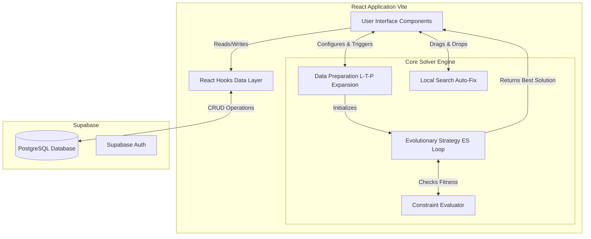
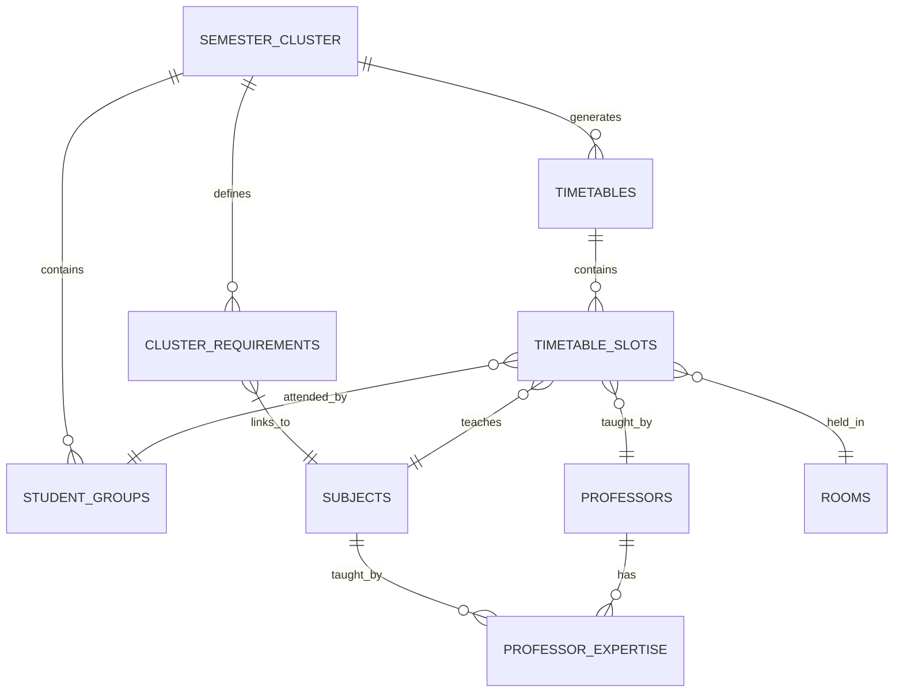
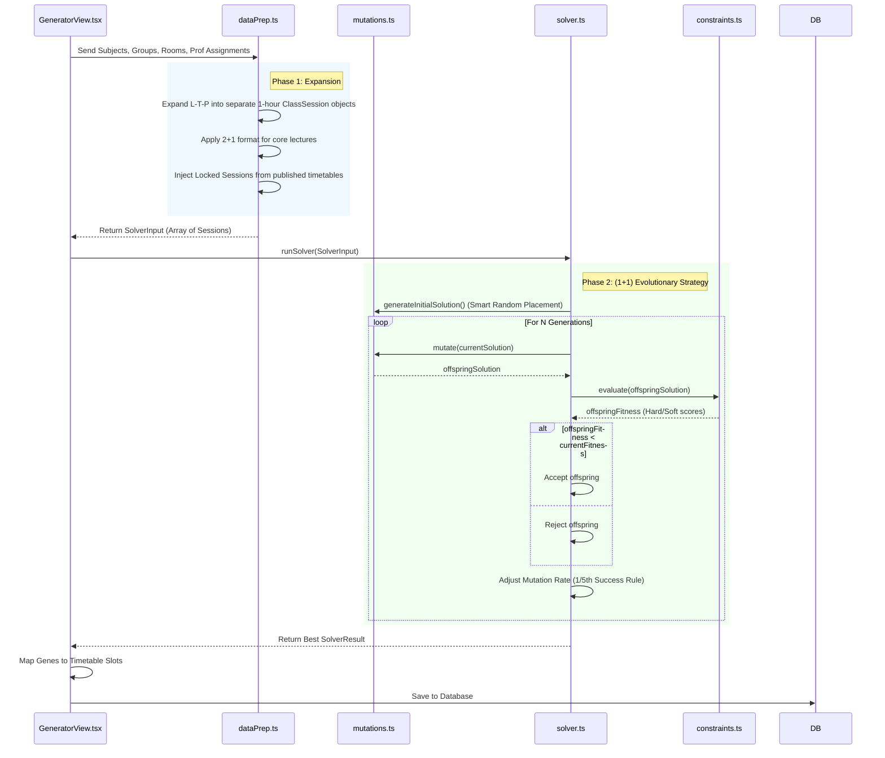
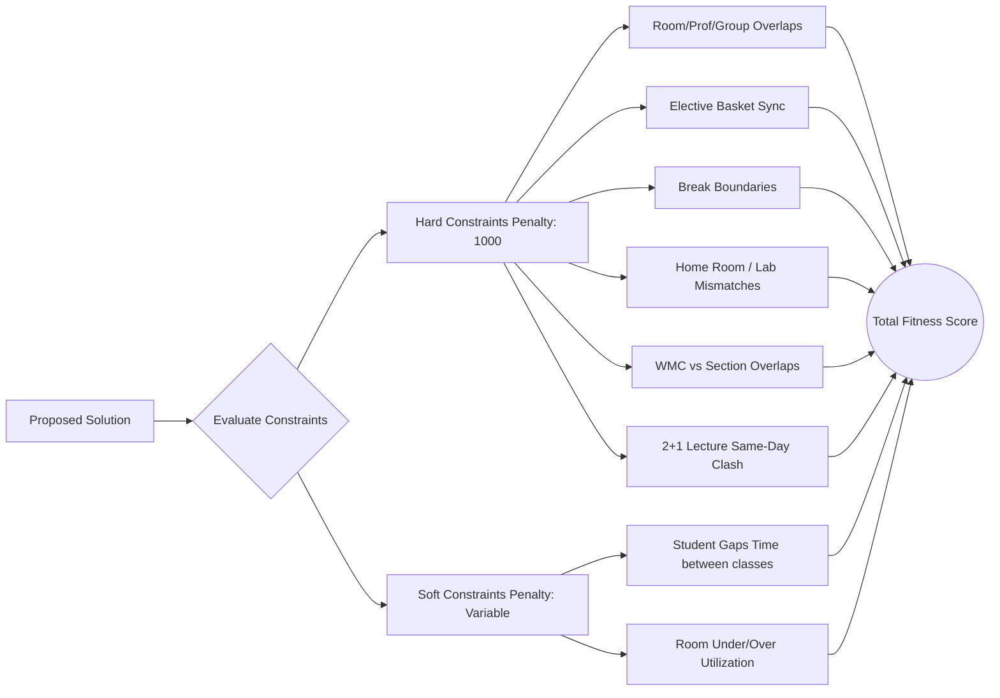
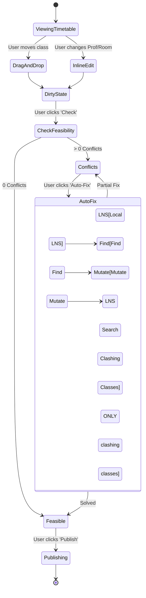

# Timetable Generator & Editor Architecture

This document explains the complete working of your project from the database layer all the way up to the evolutionary solver and the interactive user interface. 

---

## 1. High-Level System Architecture

At its core, the project is a modern, client-heavy React web application. It offloads all data persistence to Supabase while running the computationally heavy timetable generation directly in the browser using TypeScript.

---

## 2. The Core Data Model

The system's data is heavily relational. A "Semester Cluster" is the root entity that groups together everything needed to generate a timetable for a specific batch.

- **Semester Cluster**: E.g., "IT Dept, Sem 5, 2026 Batch".
- **Cluster Requirements**: The bridge table detailing which subjects are taught in this cluster, including estimated enrollments and elective baskets.
- **Subjects**: Contains the vital `L-T-P` (Lectures-Tutorials-Practicals) split and duration metadata.

---

## 3. The Generator Flow (How Timetables are Born)

When you click **"Generate Timetable"**, a complex pipeline converts database rows into an optimized schedule.

### Expanding L-T-P
The magic starts in `dataPrep.ts`. If a subject has 3 Lectures, 1 Tutorial, and 1 Practical (2 hours), the system expands this single subject into **5 distinct `ClassSession` objects** that the algorithm must place on the grid independently.

---

## 4. Constraint Evaluation Logic

The solver's intelligence lives entirely in how it scores a timetable. A perfect timetable has **0 Hard Violations**.

*The solver blindly moves classes around, but it is heavily penalized by `constraints.ts` anytime it breaks a rule, forcing the evolution toward a 0-conflict state.*

---

## 5. The Editor Flow (Manual Adjustments & Auto-Fix)

Once a timetable is saved, you enter the Editor. The editor allows manual drag-and-drop, but it also has its own localized solver for quick fixes.

### The Auto-Fix Magic (LNS)
When you use "Auto-Fix", the system runs a **Large Neighborhood Search (LNS)**. Unlike the main generator which mutates *any* class randomly, the LNS in `localSearch.ts` specifically targets **only** the classes causing conflicts, leaving your perfectly placed classes completely untouched.
